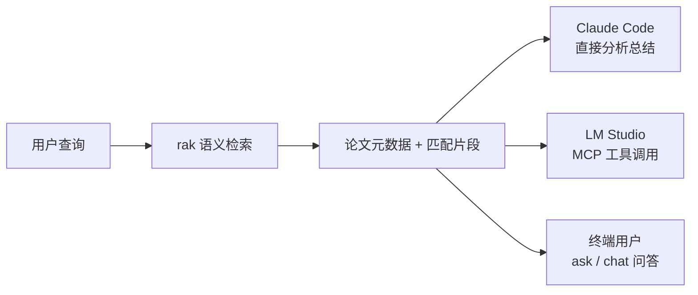
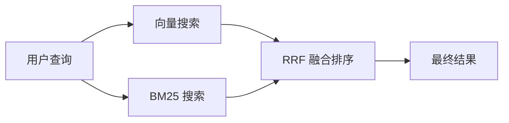
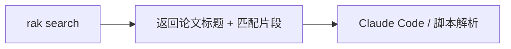
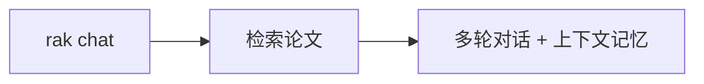
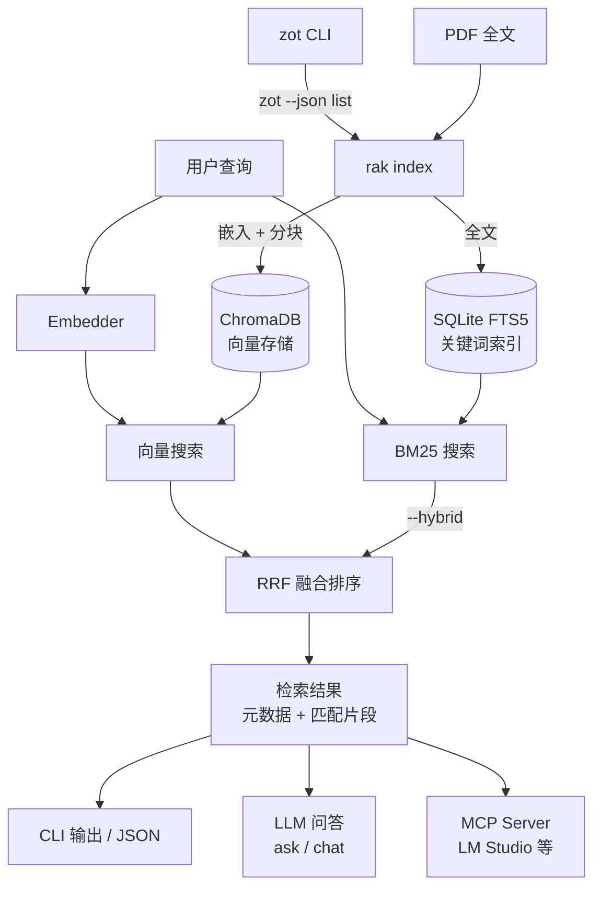
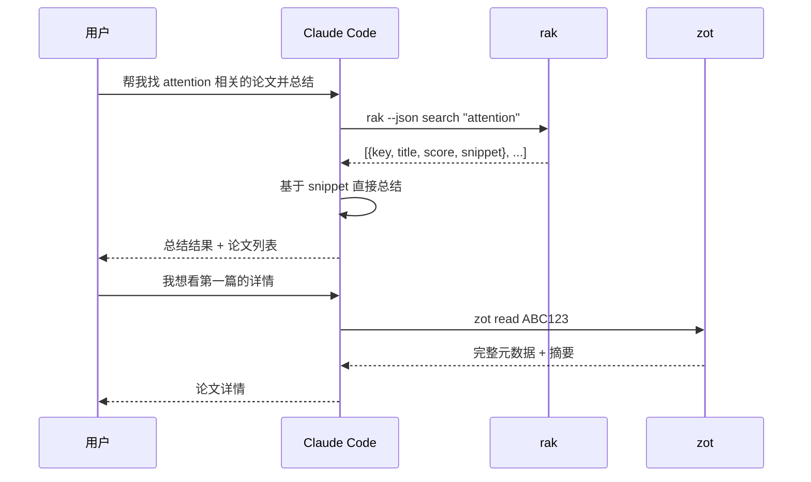
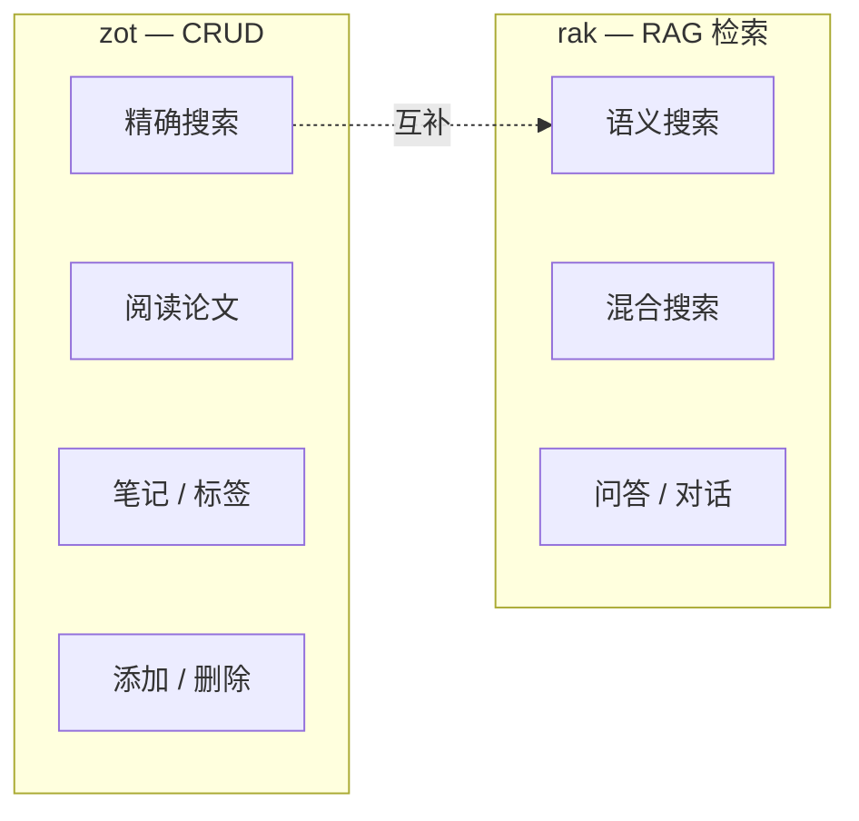

# rak — Zotero 文献库 RAG 语义检索

[English](README_EN.md)

`rak` 是基于 RAG 的 Zotero 语义检索工具。通过本地嵌入模型将论文向量化，支持语义搜索和混合检索，返回最相关的论文及匹配片段。

## 核心理念

**rak 只做一件事：语义检索。** 找到最相关的论文和匹配的文本片段，交给调用方（Claude Code / LM Studio / 人）决定下一步。



## 三种检索模式

rak 提供三种检索模式，适用于不同场景：


> **向量搜索**（默认）：将查询转化为向量，在 ChromaDB 中找语义最相似的论文。能理解同义词和跨语言表达，如 "细胞命运决定" 匹配 "cell fate determination"。


> **BM25 关键词搜索**：在索引的全文内容（标题 + 摘要 + PDF 全文）中做关键词匹配和排序。根据词频和文档长度计算相关性 — 确保包含精确关键词（如 "CRISPR-Cas9"）的论文不被遗漏。



> **混合搜索**（`--hybrid`）：向量 + BM25 两路检索，通过 RRF（Reciprocal Rank Fusion）融合排序。兼顾语义理解和精确关键词，效果最好。

| 模式 | 命令 | 优势 | 适用场景 |
|------|------|------|----------|
| **向量搜索** | `rak search "query"` | 理解语义和同义词 | 探索性查询 |
| **BM25 搜索** | 混合搜索的内部组件 | 精确关键词，搜 PDF 全文 | — |
| **混合搜索** | `rak search "query" --hybrid` | 语义 + 关键词，最准 | 推荐默认使用 |

## 三种使用方式






| 模式 | 命令 | 给谁用 | 需要 LLM？ |
|------|------|--------|:---:|
| **搜索** | `rak search` | AI 助手 / 脚本 | 不需要 |
| **问答** | `rak ask` | 人（终端快速提问） | 需要 |
| **对话** | `rak chat` | 人（深入讨论） | 需要 |

## 安装

```bash
# 推荐
uv tool install zotero-rag-cli

# 或者
pip install zotero-rag-cli

# 如需 MCP Server（LM Studio / Cursor）
pip install zotero-rag-cli[mcp]
```

前置依赖：[`zot`](https://github.com/Agents365-ai/zotero-cli-cc)（Zotero CLI，用于获取文献数据）。

## 快速开始

```bash
# 1. 索引（增量，自动提取 PDF 全文并分块）
rak index

# 2. 语义搜索
rak search "cell fate determination"

# 3. 混合搜索（语义 + BM25 关键词）
rak search "spatial transcriptomics" --hybrid

# 4. 终端问答（需要 LLM）
rak ask "单细胞聚类的主要方法有哪些？"

# 5. 多轮对话（需要 LLM）
rak chat
```

## 数据流



## 命令详解

### 索引

```bash
rak index                    # 增量索引（仅新增/变更）
rak index --full             # 全量重建
rak index --limit 500        # 限制项目数
```

自动从 `~/Zotero/storage/` 提取 PDF 和 Markdown 附件全文，长文档分割为重叠片段（512 词，64 词重叠）。

### 嵌入模型

默认使用 `all-MiniLM-L6-v2`，支持所有 [sentence-transformers](https://huggingface.co/models?library=sentence-transformers) 模型。切换模型后需重建索引：

```bash
rak config model_name BAAI/bge-m3
rak clear --yes && rak index
```

常用模型推荐：

| 模型 | 维度 | 大小 | 适用场景 |
|------|------|------|----------|
| `all-MiniLM-L6-v2` (默认) | 384 | 80MB | 英文论文，速度快 |
| `all-mpnet-base-v2` | 768 | 420MB | 英文最佳质量 |
| `BAAI/bge-small-en-v1.5` | 384 | 130MB | 英文，性价比高 |
| `BAAI/bge-small-zh-v1.5` | 512 | 95MB | 中文论文优化 |
| `BAAI/bge-m3` | 1024 | 2.2GB | 多语言，最强但较慢 |
| `intfloat/multilingual-e5-small` | 384 | 470MB | 多语言轻量 |

### 搜索

```bash
rak search "单细胞 RNA 测序方法"
rak search "CRISPR off-target" --hybrid
rak search "attention" --limit 5
rak search "RNA-seq" --collection "My Papers" --tag "methods"
rak --json search "spatial omics"       # JSON 输出（含匹配片段）
```

`--json` 输出示例：

```json
[
  {
    "key": "ABC123",
    "title": "Attention Is All You Need",
    "score": 0.89,
    "source": "vector",
    "snippet": "We propose a new simple network architecture..."
  }
]
```

### 问答

```bash
rak ask "关于细胞命运的主要发现是什么？"
rak ask "比较 CRISPR 方法" --context 10 --hybrid
```

### 对话

```bash
rak chat                                # 启动交互会话
rak chat --hybrid --context 10          # 混合搜索 + 更多上下文
rak chat --collection "My Papers"       # 限定 collection
```

对话内置命令：`/search <查询>` · `/context` · `/tokens` · `/help` · `/quit`

### 导出

```bash
rak export "single cell" --format csv
rak export "CRISPR" --format bibtex --output refs.bib
```

### 配置

```bash
rak config                              # 显示所有设置
rak config llm_model deepseek-chat      # 设置 LLM 模型
rak config llm_base_url https://api.deepseek.com
rak config llm_api_key sk-xxx           # 设置 API Key
```

<details>
<summary>LLM 配置示例</summary>

```bash
# DeepSeek（推荐云端）
rak config llm_base_url https://api.deepseek.com
rak config llm_model deepseek-chat
rak config llm_api_key sk-your-key

# OpenAI
rak config llm_base_url https://api.openai.com/v1
rak config llm_model gpt-4o
rak config llm_api_key sk-your-key

# 本地 Ollama（默认）
rak config llm_base_url http://localhost:11434/v1
rak config llm_model llama3
rak config llm_api_key not-needed
```

</details>

### 其他

```bash
rak status                  # 索引状态
rak clear --yes             # 清除所有索引
rak completion zsh           # Shell 补全
eval "$(rak completion)"    # 启用补全
```

## 在 Claude Code 中使用



Claude Code 自身就是大模型，不需要 `rak ask` — 直接用 `rak search` 获取片段后自己分析。

建议在 `~/.claude/CLAUDE.md` 中添加：

```markdown
### Zotero
- 语义搜索用 `rak --json search`，精确搜索/CRUD 用 `zot`
- `rak` 返回匹配片段（snippet），可直接分析，无需读全文
```

## MCP Server

供 LM Studio / Cursor / Claude Desktop 等支持 MCP 的工具使用。

```bash
pip install zotero-rag-cli[mcp]
```

```json
{
  "mcpServers": {
    "rak": {
      "command": "rak-mcp"
    }
  }
}
```

| 工具 | 功能 |
|------|------|
| `search_papers` | 语义/混合搜索，返回论文元数据 + 匹配片段 |
| `index_status` | 查看索引状态 |

## 搭配 zot 使用



| 工具 | 职责 | 适用场景 |
|------|------|----------|
| `zot` | Zotero CRUD（搜索、阅读、笔记、标签、导出） | 明确知道要找什么 |
| `rak` | RAG 语义检索 + 问答 | 探索性搜索、AI 辅助分析 |

## 选项速查

| 选项 | 适用命令 | 说明 |
|------|----------|------|
| `--json` | 全局 | JSON 输出（含 snippet） |
| `--hybrid` | search, ask, chat, export | 混合搜索 |
| `--limit N` | search, export | 结果数量 |
| `--collection` | search, ask, chat, export | 按 collection 过滤 |
| `--tag` | search, ask, chat, export | 按标签过滤（可重复，OR 逻辑） |
| `--full` | index | 全量重建 |
| `--context N` | ask, chat | 上下文论文数 |
| `--llm-model` | ask, chat | LLM 模型 |
| `--llm-url` | ask, chat | LLM 服务地址 |
| `--format` | export | csv / bibtex |
| `--output` | export | 输出文件 |

## 同类工具对比

| 特性 | **rak** | [zotero-mcp](https://github.com/54yyyu/zotero-mcp) | [cookjohn/zotero-mcp](https://github.com/cookjohn/zotero-mcp) | [ZoteroBridge](https://github.com/Combjellyshen/ZoteroBridge) |
|---|:---:|:---:|:---:|:---:|
| 语义搜索 | **✅** | ✅ | ✅ | ❌ |
| 混合搜索（向量 + BM25） | **✅** | ❌ | ❌ | ❌ |
| PDF 分块索引 | **✅** | ❌ | ❌ | ❌ |
| 匹配片段返回 | **✅** | ❌ | ❌ | ❌ |
| LLM 问答 | **✅** 本地/云端 | 云 API | 云 API | 云 API |
| 多轮对话 | **✅** | ❌ | ❌ | ❌ |
| 100% 本地可用 | **✅** | ❌ | ❌ | ❌ |
| CLI 终端 | **✅** | ❌ | ❌ | ❌ |
| MCP 协议 | **✅** | ✅ | ✅ | ✅ |
| 增量索引 | **✅** | N/A | N/A | N/A |

### 为什么选择 rak？

> **唯一同时提供 CLI + MCP、本地语义检索 + 片段返回的 Zotero RAG 工具。**

- **精准**：PDF 分块 + 混合搜索 + 返回匹配片段，而非整篇论文
- **本地化**：嵌入、搜索全在本机，搜索模式无需 API Key
- **灵活**：CLI 给终端和 Claude Code，MCP 给 LM Studio 和 Cursor
- **隐私**：论文数据永不离开本机

## TODO

- [ ] BM25 索引添加 `doc_id` 唯一性约束，防止重复插入导致评分膨胀
- [ ] 重命名 `get_by_metadata` → `get_ids_by_metadata`，明确接口语义
- [ ] 添加 `--verbose` 全局选项，启用 debug 级别日志输出便于排查问题

## 相关项目

- **[zotero-cli-cc](https://github.com/Agents365-ai/zotero-cli-cc)** — Zotero CLI CRUD 工具（`rak` 的前置依赖）

---

## 支持作者

<table>
  <tr>
    <td align="center">
      
      <br>
      <b>微信支付</b>
    </td>
    <td align="center">
      
      <br>
      <b>支付宝</b>
    </td>
    <td align="center">
      
      <br>
      <b>Buy Me a Coffee</b>
    </td>
  </tr>
</table>

## 许可证

MIT
