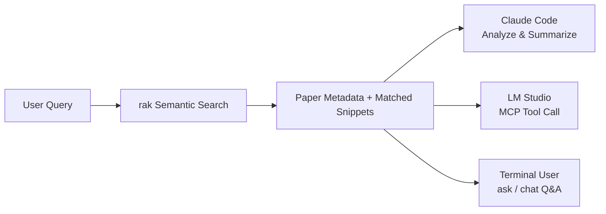
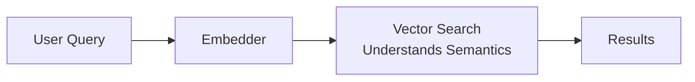
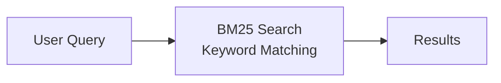
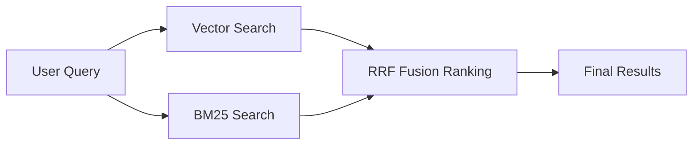
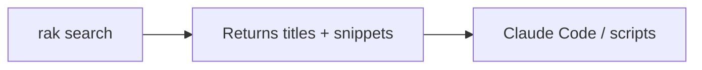
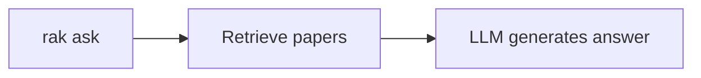
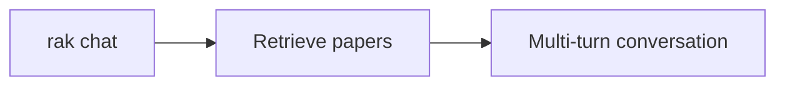
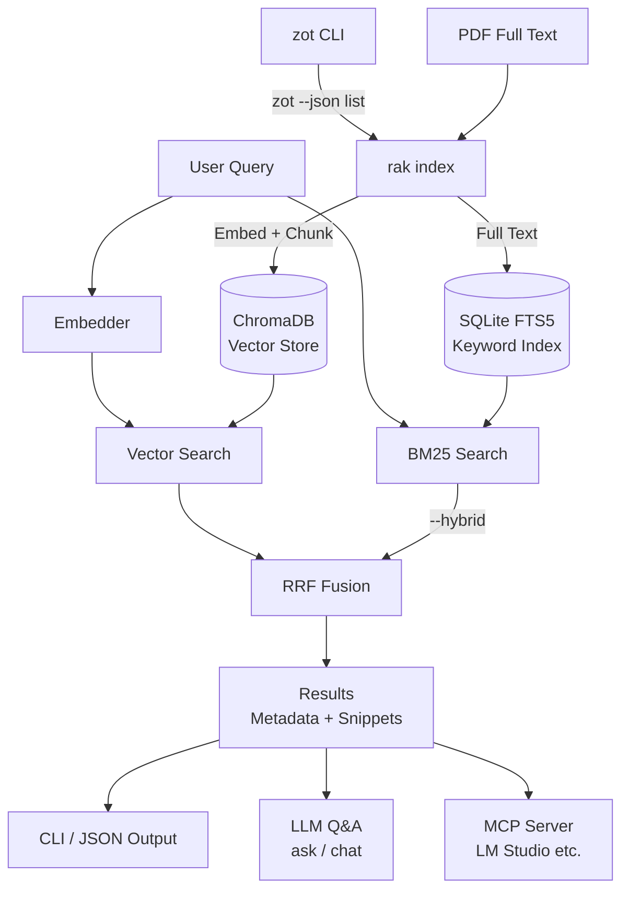
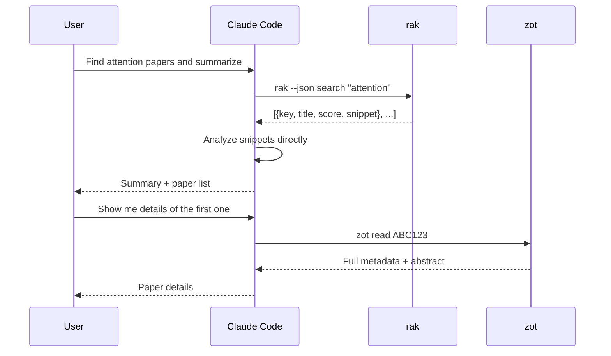
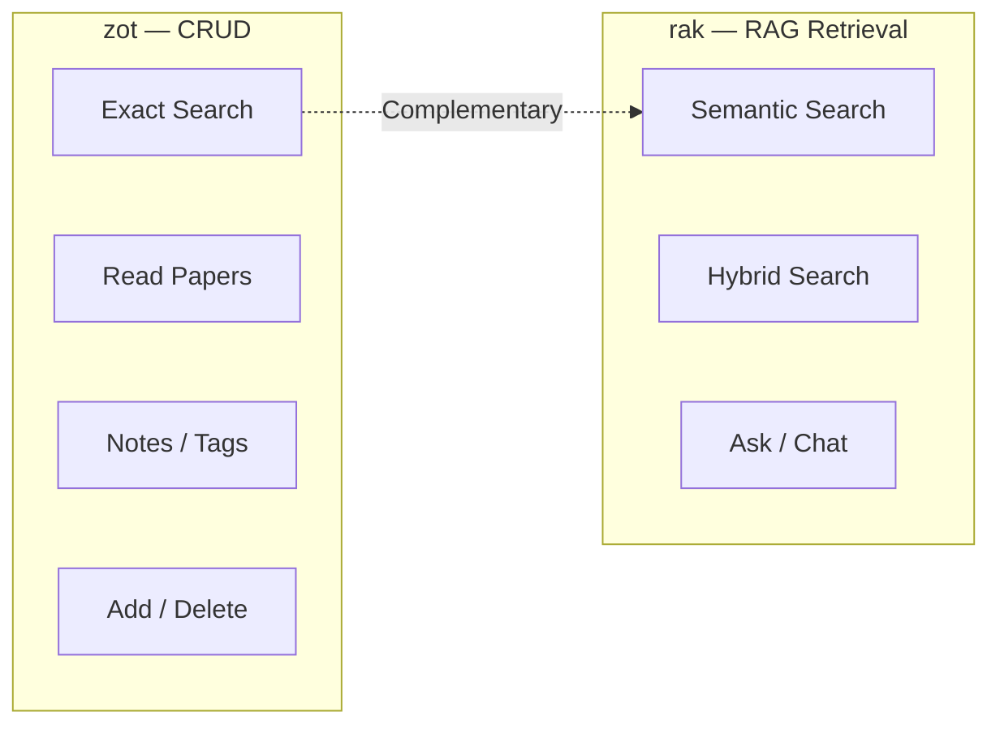

# rak — RAG Semantic Search for Zotero

[中文](README.md)

`rak` is a RAG-based semantic search tool for Zotero libraries. It vectorizes papers using local embedding models, supports semantic and hybrid search, and returns the most relevant papers with matched text snippets.

## Core Concept

**rak does one thing: semantic retrieval.** It finds the most relevant papers and matching text snippets, then hands them to the caller (Claude Code / LM Studio / human) to decide what to do next.



## Three Retrieval Modes

rak provides three retrieval modes for different scenarios:



> **Vector Search** (default): Converts query into a vector and finds semantically similar papers in ChromaDB. Understands synonyms and cross-language expressions, e.g. "cell fate determination" matches "细胞命运决定".



> **BM25 Keyword Search**: Matches keywords across all indexed content (title + abstract + PDF full text) and ranks by relevance using term frequency and document length — ensures papers containing exact keywords like "CRISPR-Cas9" are not missed.



> **Hybrid Search** (`--hybrid`): Runs both vector + BM25, fuses results via RRF (Reciprocal Rank Fusion). Combines semantic understanding with exact keyword matching — best overall accuracy.

| Mode | Command | Strength | Best For |
|------|---------|----------|----------|
| **Vector** | `rak search "query"` | Semantic understanding | Exploratory queries |
| **BM25** | Internal component of hybrid | Exact keywords, PDF full text | — |
| **Hybrid** | `rak search "query" --hybrid` | Semantic + keywords, most accurate | Recommended default |

## Three Usage Modes







| Mode | Command | For Whom | LLM Required? |
|------|---------|----------|:---:|
| **Search** | `rak search` | AI assistants / scripts | No |
| **Ask** | `rak ask` | Humans (quick terminal Q&A) | Yes |
| **Chat** | `rak chat` | Humans (deep discussion) | Yes |

## Install

```bash
# Recommended
uv tool install zotero-rag-cli

# Or
pip install zotero-rag-cli

# For MCP Server (LM Studio / Cursor)
pip install zotero-rag-cli[mcp]
```

Requires [`zot`](https://github.com/Agents365-ai/zotero-cli-cc) (Zotero CLI for fetching library data).

## Quick Start

```bash
# 1. Index (incremental, auto PDF extraction + chunking)
rak index

# 2. Semantic search
rak search "cell fate determination"

# 3. Hybrid search (semantic + BM25 keywords)
rak search "spatial transcriptomics" --hybrid

# 4. Terminal Q&A (requires LLM)
rak ask "What are the main single-cell clustering methods?"

# 5. Find similar papers
rak similar ABC12345

# 6. Multi-turn chat (requires LLM)
rak chat
```

## Data Flow



## Commands

### Index

```bash
rak index                    # Incremental (new/changed only)
rak index --full             # Full rebuild
rak index --limit 500        # Limit items
```

Auto-extracts PDF and Markdown attachments from `~/Zotero/storage/`, splits long documents into overlapping chunks (512 words, 64 overlap).

### Embedding Models

Default: `all-MiniLM-L6-v2`. Supports any [sentence-transformers](https://huggingface.co/models?library=sentence-transformers) model. Rebuild index after switching:

```bash
rak config model_name BAAI/bge-m3
rak clear --yes && rak index
```

Recommended models:

| Model | Dim | Size | Best for |
|-------|-----|------|----------|
| `all-MiniLM-L6-v2` (default) | 384 | 80MB | English, fast |
| `all-mpnet-base-v2` | 768 | 420MB | English, best quality |
| `BAAI/bge-small-en-v1.5` | 384 | 130MB | English, good balance |
| `BAAI/bge-small-zh-v1.5` | 512 | 95MB | Chinese papers |
| `BAAI/bge-m3` | 1024 | 2.2GB | Multilingual, strongest |
| `intfloat/multilingual-e5-small` | 384 | 470MB | Multilingual, lightweight |
| `jinaai/jina-embeddings-v3` | 1024 | 2.3GB | Multilingual, long context (8192 tokens) |

### API Embedding Models

Also supports remote embedding models via API (OpenAI `/v1/embeddings` compatible):

```bash
# OpenAI
rak config embedding_provider api
rak config embedding_base_url https://api.openai.com/v1
rak config embedding_api_key sk-your-key
rak config model_name text-embedding-3-small
rak clear --yes && rak index

# Qwen (Alibaba Cloud DashScope)
rak config embedding_provider api
rak config embedding_base_url https://dashscope.aliyuncs.com/compatible-mode/v1
rak config embedding_api_key sk-your-key
rak config model_name text-embedding-v3
rak clear --yes && rak index

# Local Ollama
rak config embedding_provider api
rak config embedding_base_url http://localhost:11434/v1
rak config embedding_api_key not-needed
rak config model_name nomic-embed-text
rak clear --yes && rak index

# Switch back to local model
rak config embedding_provider local
rak config model_name all-MiniLM-L6-v2
rak clear --yes && rak index
```

### Search

```bash
rak search "single cell RNA sequencing methods"
rak search "CRISPR off-target" --hybrid
rak search "attention" --limit 5
rak search "RNA-seq" --collection "My Papers" --tag "methods"
rak --json search "spatial omics"       # JSON output (with snippets)
```

`--json` output example:

```json
[
  {
    "key": "ABC123",
    "title": "Attention Is All You Need",
    "score": 0.89,
    "source": "vector",
    "snippet": "We propose a new simple network architecture..."
  }
]
```

### Ask

```bash
rak ask "What are the main findings about cell fate?"
rak ask "Compare CRISPR methods" --context 10 --hybrid
```

### Chat

```bash
rak chat                                # Start interactive session
rak chat --hybrid --context 10          # Hybrid + more context
rak chat --collection "My Papers"       # Filter by collection
```

Chat commands: `/search <query>` · `/context` · `/tokens` · `/help` · `/quit`

### Export

```bash
rak export "single cell" --format csv
rak export "CRISPR" --format bibtex --output refs.bib
```

### Config

```bash
rak config                              # Show all settings
rak config llm_model deepseek-chat      # Set LLM model
rak config llm_base_url https://api.deepseek.com
rak config llm_api_key sk-xxx           # Set API key
```

<details>
<summary>LLM Configuration Examples</summary>

```bash
# DeepSeek (recommended cloud)
rak config llm_base_url https://api.deepseek.com
rak config llm_model deepseek-chat
rak config llm_api_key sk-your-key

# OpenAI
rak config llm_base_url https://api.openai.com/v1
rak config llm_model gpt-4o
rak config llm_api_key sk-your-key

# Local Ollama (default)
rak config llm_base_url http://localhost:11434/v1
rak config llm_model llama3
rak config llm_api_key not-needed
```

</details>

### Other

```bash
rak status                  # Index status
rak clear --yes             # Clear all indexes
rak completion zsh           # Shell completions
eval "$(rak completion)"    # Enable completions
```

## Using with Claude Code



Claude Code IS the LLM — no need for `rak ask`. Use `rak search` to get snippets, then Claude analyzes directly.

Add to `~/.claude/CLAUDE.md`:

```markdown
### Zotero
- Semantic search: `rak --json search`, exact search/CRUD: `zot`
- `rak` returns matched snippets, analyze directly without reading full papers
```

## MCP Server

For LM Studio / Cursor / Claude Desktop.

```bash
pip install zotero-rag-cli[mcp]
```

```json
{
  "mcpServers": {
    "rak": {
      "command": "rak-mcp"
    }
  }
}
```

| Tool | Purpose |
|------|---------|
| `search_papers` | Semantic/hybrid search, returns metadata + snippets |
| `search_papers_bm25` | Pure keyword search, no embedding model needed |
| `similar_papers` | Find similar papers by Zotero key |
| `ask_papers` | LLM Q&A with paper context |
| `export_papers` | Export search results as CSV or BibTeX |
| `show_config` | Show current configuration |
| `index_status` | Show index status |

## Using with zot



| Tool | Role | When to Use |
|------|------|-------------|
| `zot` | Zotero CRUD (search, read, notes, tags, export) | You know what you're looking for |
| `rak` | RAG semantic retrieval + Q&A | Exploratory search, AI-assisted analysis |

## Options Reference

| Option | Commands | Description |
|--------|----------|-------------|
| `--json` | Global | JSON output (with snippets) |
| `--hybrid` | search, ask, chat, export | Hybrid search |
| `--limit N` | search, similar, export | Number of results |
| `--collection` | search, ask, chat, export | Filter by collection |
| `--tag` | search, ask, chat, export | Filter by tag (repeatable, OR) |
| `--full` | index | Full rebuild |
| `--context N` | ask, chat | Context documents |
| `--llm-model` | ask, chat | LLM model |
| `--llm-url` | ask, chat | LLM server URL |
| `--format` | export | csv / bibtex |
| `--output` | export | Output file |

## Comparison

| Feature | **rak** | [zotero-mcp](https://github.com/54yyyu/zotero-mcp) | [cookjohn/zotero-mcp](https://github.com/cookjohn/zotero-mcp) | [ZoteroBridge](https://github.com/Combjellyshen/ZoteroBridge) |
|---|:---:|:---:|:---:|:---:|
| Semantic Search | **✅** | ✅ | ✅ | ❌ |
| Hybrid Search (Vector + BM25) | **✅** | ❌ | ❌ | ❌ |
| PDF Chunking | **✅** | ❌ | ❌ | ❌ |
| Snippet Return | **✅** | ❌ | ❌ | ❌ |
| LLM Q&A | **✅** Local/Cloud | Cloud API | Cloud API | Cloud API |
| Multi-turn Chat | **✅** | ❌ | ❌ | ❌ |
| 100% Local | **✅** | ❌ | ❌ | ❌ |
| CLI Terminal | **✅** | ❌ | ❌ | ❌ |
| MCP Protocol | **✅** | ✅ | ✅ | ✅ |
| Incremental Index | **✅** | N/A | N/A | N/A |

### Why rak?

> **The only Zotero RAG tool with CLI + MCP, local semantic search, and snippet-level retrieval.**

- **Precise**: PDF chunking + hybrid search + returns matched snippets, not entire papers
- **Local**: Embedding and search run on your machine, no API key for search mode
- **Flexible**: CLI for terminal and Claude Code, MCP for LM Studio and Cursor
- **Private**: Paper data never leaves your machine

## TODO

- [x] Add `doc_id` uniqueness guard in BM25 index to prevent duplicate insertions inflating scores
- [x] Rename `get_by_metadata` → `get_ids_by_metadata` to clarify API semantics
- [x] Add `--verbose` global flag to enable debug-level logging for troubleshooting
- [x] `rak search --bm25` pure keyword search mode without loading embedding model
- [x] Rich progress bar for indexing (replace `Indexed 50/3038...`)
- [x] MinerU / Docling PDF parsing: `rak config pdf_provider mineru` or `docling` for high-quality PDF extraction (preserves tables/formulas/layout), auto-fallback to PyMuPDF on failure
- [x] `rak similar KEY` to find papers similar to a given one
- [x] Smart chunking: split by paragraphs/sections instead of fixed 512-word windows
- [ ] `rak notes KEY`: AI-generated paper summary notes, cached locally for quick review
- [ ] `rak cluster`: Auto-cluster papers by embedding similarity, discover research themes
- [ ] Web UI: Streamlit visual search dashboard (low priority)
- [ ] Improve test coverage: CLI module at ~51%, harden before adding new features
- [ ] Async PDF extraction: parallelize the slowest part of indexing
- [ ] GitHub Actions CI: automate tests + PyPI publishing on tag
- [x] README update: document MCP tools and v0.6.1 improvements
- [ ] Documentation site: MkDocs Material + GitHub Pages (after `notes` and `cluster` are done)

## Related Projects

- **[zotero-cli-cc](https://github.com/Agents365-ai/zotero-cli-cc)** — Zotero CLI for CRUD (required dependency)

---

## Support

<table>
  <tr>
    <td align="center">
      
      <br>
      <b>WeChat Pay</b>
    </td>
    <td align="center">
      
      <br>
      <b>Alipay</b>
    </td>
    <td align="center">
      
      <br>
      <b>Buy Me a Coffee</b>
    </td>
  </tr>
</table>

## License

MIT
